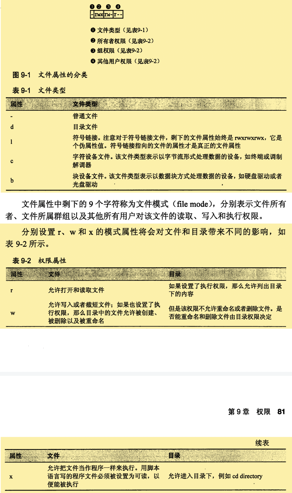
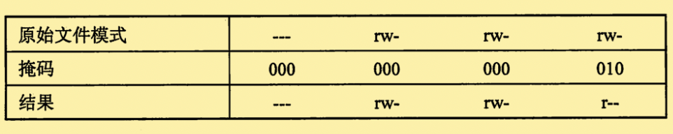

# 权限

- linux不仅是**多重任务处理**系统，而且还是**多用户**系统。

| 命令   | 功能                         |
| ------ | ---------------------------- |
| id     | 显示用户身份标示             |
| chmod  | 更改文件的模式               |
| umask  | 设置文件默认的权限           |
| su     | 以另一个用户的身份运行shell  |
| sudo   | 以另一个用户的身份来执行命令 |
| chown  | 更改文件所有者               |
| chgrp  | 更改文件所属的群组           |
| passwd | 更改用户密码                 |

## 所有者、组成员、和其他所有用户

​	在UNIX安全模型中：

- 一个用户可以拥有文件和目录。当一个用户拥有一个文件或者目录的时候，它将对该文件或者目录的访问权限拥有控制权。
- 用户归属于一个群组，该组群由一个或者多个用户组成。
- 文件所有者可以授予所有用户一些访问权限。
  - 所有用户是指整个世界。


### id——可以获得用户身份标识信息

```shell
[hadoop@hadoop05 ~]$ id
uid=500(hadoop) gid=500(hadoop) groups=500(hadoop)
```

- 这些信息，来自于一系列的文本文件。
  - 用户账户定义在/etc/passwd
  - 用户组定义在/etc/group
  - 创建账户和组的时候，这些文件随着/etc/shadow的变动而修改，/etc/shadow中保存了用户的密码信息。

## 读入、写入和执行

​	对文件和目录的访问权限是按照：读访问、写访问以及执行访问来定义的。

- `ls -l`命令，可以得到文件的属性。
- 

### chmod——更改文件模式

- 只有<u>文件的所有者</u>和<u>超级用户</u>才可以更改文件或者目录的模式。

- 支持两种方式更改——八进制数字表示法、符号表示法。

  - 八进制表示法

    - | 八进制 | 二进制 | 模式 |
      | ------ | ------ | ---- |
      | **0**  | 000    | ---  |
      | 1      | 001    | --x  |
      | 2      | 010    | -w-  |
      | 3      | 011    | -wx  |
      | **4**  | 100    | r--  |
      | **5**  | 101    | r-x  |
      | **6**  | 110    | rw-  |
      | **7**  | 111    | rwx  |

  - 符号表示法

    - | 符号 | 含义                           |
      | ---- | ------------------------------ |
      | u    | user，表示文件或者目录的所有者 |
      | g    | group，文件所属的群组          |
      | o    | other，表示其他所有用户        |
      | a    | all，u,g,o三者的组合           |

      +表示添加一种权限

    - -表示删除一种权限

    - =表示只有指定的权限可用

      - | 符号       | 含义                                                         |
        | ---------- | ------------------------------------------------------------ |
        | u+x        | 为文件所有者添加可执行权限                                   |
        | u-x        | 删除文件所有者的可执行权限                                   |
        | +x         | 为所有者、所属组群和其他所有用户添加可执行权限；等价于a+x    |
        | o-rw       | 删除其他所有者的读写权限                                     |
        | go=rw      | 设置所属群组、其他用户具有读写权限；如果og之前拥有可执行权限，则删除可执行权限。 |
        | u+x，go=rx | 指定多种权限的时候，用逗号分隔。                             |

      

### umask——设置默认权限

- 运行不带参数的umask，可以查看当前的`掩码值（0002）`，它是掩码的八进制表示形式。
- 掩码值 0000 实际上是关闭该功能。
- 
  - 注意掩码出现1的地方，对应的属性被删除。

## 更改身份

### su——以其他用户和组的身份来运行shell。

- `su [-[l]] [user]`

  - 如果包含-l选项，那么shell会话界面将是用于指定用户的登录shell界面。

  - `-l`可以缩写为`-`

  - ```shell
    [hadoop@hadoop05 ccc]$ su -
    Password: 
    [root@hadoop05 ~]# exit
    logout
    [hadoop@hadoop05 ccc]$ 
    #su - 进入超级用户 ，提示符结尾会更改为#，而不是$。
    #exit 会退出，并返回之前的shell环境。
    ```

- 可以使用`su -c 'commond'`来执行单个命令。

  - ```shell
    [hadoop@hadoop05 ccc]$ su -c 'ls -l /root'
    Password: 
    total 8
    drwxr-xr-x 17  501  501 4096 Jun 16  2018 Python-3.6.4
    drwxr-xr-x  2 root root 4096 Jun 16  2018 soft
    [hadoop@hadoop05 ccc]$ 
    ```

### sudo——以另一个用户的身份来执行命令

​	sudo很多方面类似于su命令，同时由一些重要功能。

- 管理者通过配置sudo命令，使系统以一种可控的方式，允许一个普通用户以一个不同的用户身份（通常为超级用户）执行命令。
- sudo命令不需要输入超级用户的密码，只需要输入自己的密码来认证。
- sudo不需要启动一个新的shell环境，也不需要加载另一个用户的运行环境。
- 可以使用`sudo -l`来查看授予那些权限。
- 第一次使用sudo命令之后，系统会“信任”用户几分钟。

### chown——更改文件所有者和所属群组

- 这个命令需要超级用户权限。

- 格式：`chown [ower][:[group]] file`

  - | 参数          | 结果                                                         |
    | ------------- | ------------------------------------------------------------ |
    | hadoop        | 将文件所有者从当前所有者更改为hadoop                         |
    | hadoop：users | 将文件所有者更改为用户hadoop，并把文件所属群组更改为users    |
    | ：admins      | 把文件所属群组更改为admins组，文件所有者不变                 |
    | hadoop：      | 把文件所有者更改为hadoop并把所属群组更改为hadoop登陆系统的群组 |

### chgrp——更改文件所属群组

- 与chown基本一致

## 更改用户密码

- 对于用户自己的密码：
  - 直接输入passwd命令，然后输入旧密码、新密码即可。
  - passwd会拒绝太短的、与之前相似的、字典中的单词或者容易猜的密码。
- 如果是超级管理员，通过指定和一个用户名作为passwd命令的参数，为其他用户设置秘密。
  - 还可以设置账户锁定、密码失效功能。


