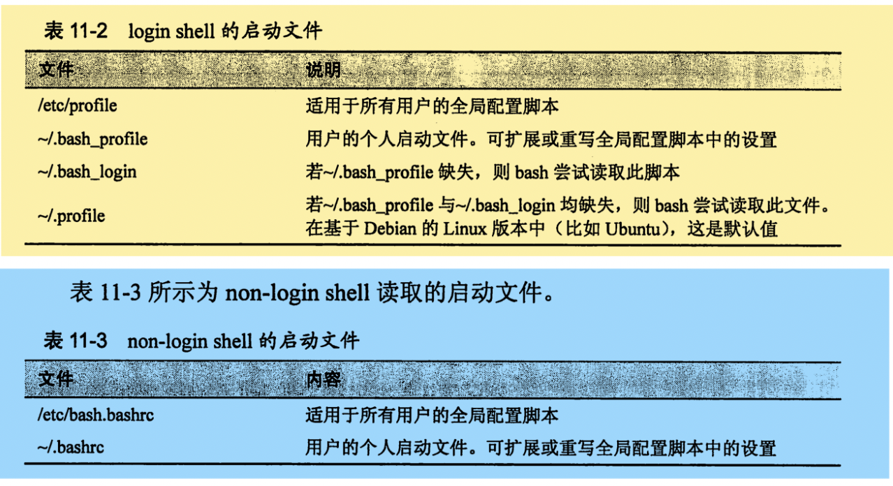

# 环境

| 命令     | 含义                             |
| -------- | -------------------------------- |
| printenv | 打印部分或者全部环境信息。       |
| set      | 设置shell选项。                  |
| export   | 将环境导出到随后要运行的程序中。 |
| alias    | 为命令创建一个别名。             |

## 什么是环境

​	shell在环境中存储了两种基本类型的数据；分别是环境变量、shell变量。

1. shell变量由bash存放少量数据。
2. 环境变量是除此之外的所有其他变量。

### 检查环境

```shell
[root@144 ~]# printenv | less
```

​	使用`set`命令或者`printenv`命令查看环境中存储的内容。

- set命令会同时显示shell变量和环境变量。
  - set命令的输出结果是按照字母排序的。
- printenv只会显示环境变量。
- 使用`alias`命令查看别名。

```shell
[root@144 ~]# alias
alias cp='cp -i'
alias egrep='egrep --color=auto'
alias fgrep='fgrep --color=auto'
alias grep='grep --color=auto'
alias l.='ls -d .* --color=auto'
alias ll='ls -l --color=auto'
alias ls='ls --color=auto'
alias mv='mv -i'
alias rm='rm -i'
alias which='alias | /usr/bin/which --tty-only --read-alias --show-dot --show-tilde'
```

### 有趣的变量

| 变量    | 说明                                                         |
| ------- | ------------------------------------------------------------ |
| SHELL   | 本机shell名称                                                |
| HOME    | 本机主目录路径名                                             |
| LANG    | 定义了本机语言的字符集和排序规则                             |
| PWD     | 当前工作目录                                                 |
| OLD_PWD | 先前工作目录                                                 |
| PATH    | 以冒号分隔的目录列表，当用户输入一个可执行程序名称时候，会查找该目录列表。 |
| TERM    | 终端类型名称                                                 |
| TZ      | 本机所处的时区                                               |
| USER    | 用户名                                                       |

## 环境是如何建立的

​	用户登陆系统之后，bash程序就会启动并读取一系列称为启动文件的配置脚本（这些脚本定义了所有用户共享的默认环境。），接下来，bash会读取更多存储在主目录下的用于定义个人环境的启动文件。执行步骤由地洞的shell会话类型决定。

### login 和 non-login shell

​	shell会话有两种类型。

- `login shell`会话会提示用户输入用户名和密码，就像虚拟控制台会话。
- GUI中启动的会话，是一个典型的`non-login shell`会话
  - 还会继承父类进程的环境，父类进程通常是一个login shell。



- 对普通用户来说，`~/.bashrc`可能是最重要的启动文件。

### 修改变量

​	一般来说，在PATH中添加目录，或者定义额外的环境变量，需要将改动放入`.bash_profile`文件中（或其他等效文件）。其他改变应该录入`.bashrc`文件中。

- 除非系统管理员需要修改用户公共的默认配置，普通用户只需要对主目录下的文件作出修改即可。

### 激活改动

```shell
[root@144 ~]# source .bashrc
```

