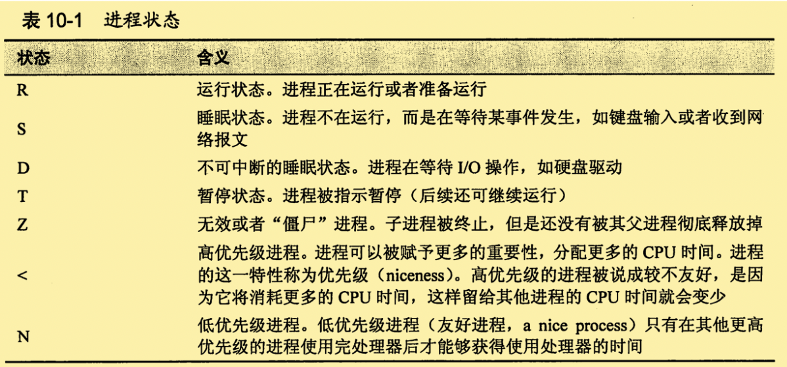
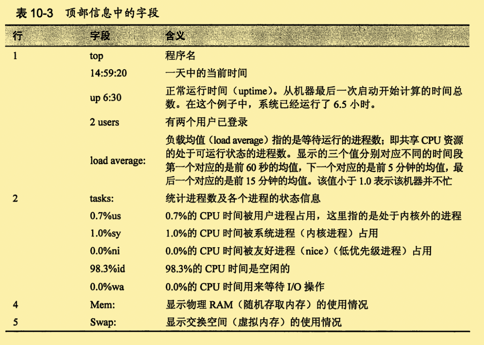
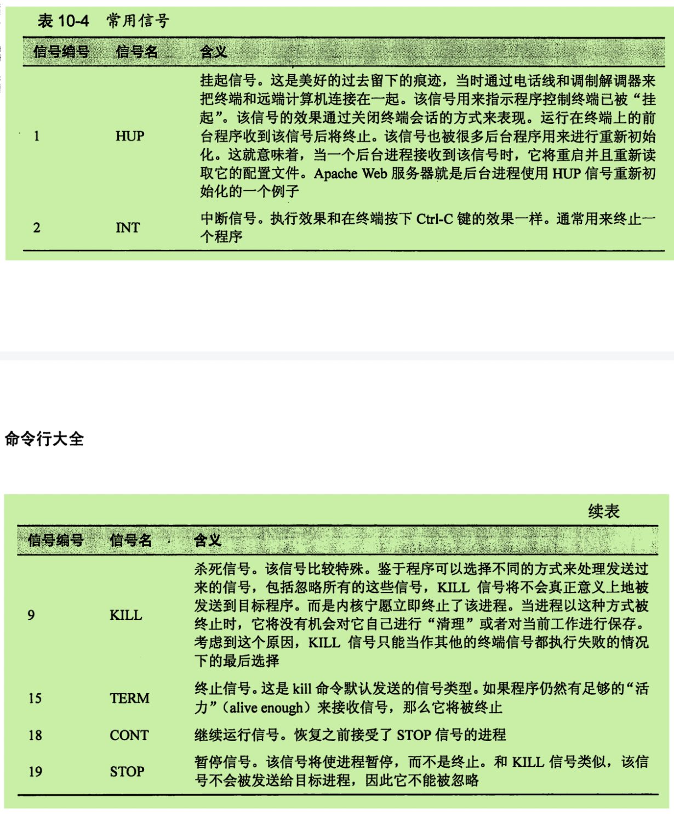

# 进程

| 命令     | 功能                                 |
| -------- | ------------------------------------ |
| ps       | 显示当前所有进程的运行情况。         |
| top      | 实时显示当前所有任务的资源占用情况。 |
| jobs     | 列出所有活动作业的状态信息。         |
| bg       | 设置在后台中运行的作业               |
| fg       | 设置在前台中运行的作业               |
| kill     | 发送信号给某个进程                   |
| killall  | 杀死指定名字的进程                   |
| shutdown | 关机或者重启系统                     |

## 进程如何工作

### ps——查看进程信息

- ps 输出与当前终端会话相关的进程信息。

- ```shell
  [hadoop@hadoop05 ccc]$ ps
     PID TTY          TIME CMD
    2588 pts/0    00:00:00 bash
    5573 pts/0    00:00:00 ps
  ```

  - TTY 是 teletype的缩写，代表进程的控制终端。
  - TIME表示了进程消耗CPU的时间总和。

- 添加 `x 选项` ，这里**没有前置连接符**，显示所有进程，不需要关注是哪一个终端控制的。

  - ```shell
    [hadoop@hadoop05 ccc]$ ps x
       PID TTY      STAT   TIME COMMAND
      2587 ?        S      0:00 sshd: hadoop@pts/0
      2588 pts/0    Ss     0:00 -bash
      5623 pts/0    R+     0:00 ps x
    ```

  - `?`表示没有控制终端。

  - 添加了一个STAT的新列，state的缩写，显示当前进程的状态。

    - 

- `aux 选项`(同样不带前置连接符)，将输出更多的信息。

- ```shell
  [hadoop@hadoop05 ccc]$ ps aux
  USER        PID %CPU %MEM    VSZ   RSS TTY      STAT START   TIME COMMAND
  root          1  0.0  0.1  19364  1348 ?        Ss   09:19   0:03 /sbin/init
  root          2  0.0  0.0      0     0 ?        S    09:19   0:00 [kthreadd]
  root          3  0.0  0.0      0     0 ?        S    09:19   0:00 [migration/0]
  ```

  - | 标题  | 含义                                                      |
    | ----- | --------------------------------------------------------- |
    | USER  | 用户ID，进程所有者                                        |
    | %CPU  | cup使用百分比                                             |
    | %MEM  | 内存使用百分比                                            |
    | VSZ   | 虚拟耗用内存大小                                          |
    | RSS   | 实际使用内存大小。进程使用物理内存（RAM）大小（kb为单位） |
    | START | 进程开启时间。超过24小时，将使用日期来显示。              |

### top——动态查看进程信息

​	按照进程活动顺序，以列表的形势持续更新显示系统进程的当前信息。（默认3秒更新一次）

- 包含两部分：
  - 顶部显示的是，系统的总体状态信息。
  - 下面显示的是，按照CPU活动时间排序的进程情况表。
  - 
- 执行top命令之后，可以接受许多键盘指令。
  - `h` 显示程序的帮助界面
  - `q` 用来退出top命令。

## 控制进程


### 中断进程

- 可以使用Ctrl + C结束程序。
  - 但是不是所有程序都可以这样结束的。

### 使进程在后台运行

- ​	使用 `&`和号字符实现程序在后台运行。
  - 此时，我们可以使用jobs来查看从终端启动的所有作业。

### 使进程回到前台运行

- 使用fg命令，后面加上一个<u>百分比符号和作业编号</u>（jobspec选项）来实现这个功能。
  - 如果后台只有一个任务，我们可以不带jobspec选项；直接Ctrl+C即可。

### 停止（暂停）进程

- Ctrl+Z暂停前台进程

  - 使用fg命令，让进程在前台恢复运行

  - 使用bg命令，让进程移动到后台运行

  - ```shell
    bg %1
    ```

## 信号


### kill 命令发送信号到进程

- kill命令的语法：`kill [-singnal] PID`

- 如果没有指定任何信号，那么默认发送TERM（终止信号）。

  - | 信号编号 | 信号名 | 含义         |
    | -------- | ------ | ------------ |
    | 1        | HUP    | 挂起信号     |
    | 2        | INT    | 中断信号     |
    | 9        | KILL   | 杀死信号     |
    | 15       | TERM   | 终止信号     |
    | 18       | CONT   | 继续运行信号 |
    | 19       | STOP   | 暂停信号     |

  

- 进程的所有者（或者超级用户）才能使用kill命令来给它发送信号。

- `kill -l`将会显示完整的信号列表。

### killall 命令发送信号给多个进程

- 语法`killall [-u user] [-signal] name...`
- 和kill一样，你必须拥有超级用户权限，才能给不属于自己的进程发送信号。

## 更多命令

### pstree

树状模式输出进程列表。

### vmstat

输出系统资源使用情况快照，包括内存，交换空间和磁盘I/O。

### xload

绘制显示系统时间负载情况的一种图形化界面

### tload

类似xload，但是图形使在终端上绘制的。Ctrl+C终止。