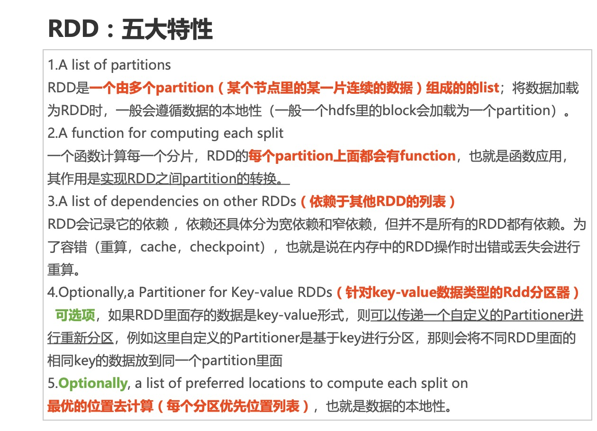

# spark-RDD

## RDD解释

- **弹性**：数据主要基于内存存储，如果内存不够，磁盘顶上。

1. 出错后可自动重新计算（通过血缘自动容错）
2. 可checkpoint（设置检查点，用于容错），可persist或cache（缓存）
3. 里面的数据是分片的（也叫分区，partition），分片的大小可自由设置和细粒度调整

- **数据集**：就是一个普通的scala的不可变的集合(Array, Map，Set)

- **分布式**：这个集合是分布式的，这个集合RDD被拆分成多个Partition(分区)存储在不同的机器里面。RDD不存储数据，数据存储在各个partition中。

  ​	

  **RDD**只是这些partition的抽象ADT(abstract data type),在这个ADT上面我们定义了非常多的操作，比如flatMap、比如map、filter等等高阶函数。

## RDD特性



## RDD算子分类

1. ###### ActionTransformation（转换算子且lazy的）

| Transformation |
| -------------- |
| map            |
| flatMap        |
| filter         |
| sample         |
| union          |
| groupByKey     |
| join           |
| reduceByKey    |
| sortByKey      |
| combineBykey   |
| aggregateByKey |

1. ###### Action

| foreach      |                                        |
| ------------ | -------------------------------------- |
| count        |                                        |
| countBykey   |                                        |
| countByValue |                                        |
| collect      |                                        |
| take         |                                        |
| first        |                                        |
| reduce       |                                        |
| saveXXX      | saveAsTextFile、saveAsNewAPIHadoopFile |

## RDD算子编程实例

```scala
package com.yber.spark

import org.apache.log4j.{Level, Logger}
import org.apache.spark.rdd.RDD
import org.apache.spark.{SparkConf, SparkContext}

import scala.collection.mutable.ArrayBuffer

object Demo01 {
  def main(args: Array[String]): Unit = {
    Logger.getLogger("org.apache.spark").setLevel(Level.WARN)
    Logger.getLogger("org.apache.hadoop").setLevel(Level.WARN)
    Logger.getLogger("org.spark_project").setLevel(Level.WARN)
    val conf = new SparkConf()
      .setAppName("Demo01").setMaster("local[*]")
    val sc = new SparkContext(conf)
    val list = 1 to 9
    val listRDD:RDD[Int] = sc.parallelize(list)
    val mapRDD = listRDD.map(t=>t*2)
    mapRDD.foreach(println)
    println("------------------------------")

    val list2 = List(
      "zhang yan bo",
      "jiao xu yang",
      "zhang mei mei"
    )
    val list2RDD:RDD[String] = sc.parallelize(list2)
    val flatRDD = list2RDD.flatMap(t => t.split("\\s+"))
    flatRDD.foreach(println)

    println("------------------------------")
    val filterRDD:RDD[String] = flatRDD.filter(t=>{
      t.length>=5
    })
    filterRDD.foreach(println)
    println("------------------------------")

    val list3 = 1 to 100000
    val list3RDD:RDD[Int] = sc.parallelize[Int](list3)
    val sampleRDD:RDD[Int] = list3RDD.sample(true,0.5)
    println(sampleRDD.count())
    val sampleRDD2:RDD[Int] = list3RDD.sample(false,0.5)
    println(sampleRDD2.count())
    println("------------------------------")

    val list4 = List(
      "hello",
      "java",
      "hadoop",
      "spark",
      "python"
    )
    val list5 = List("hello","java","python","hive")
    val list4RDD = sc.parallelize(list4)
    val list5RDD = sc.parallelize(list5)

    val unionRDD:RDD[String] = list4RDD.union(list5RDD)
    println(unionRDD.count())
    unionRDD.foreach(println)
    println("------------------------------")


    val list6 = List(
      "zy-fy-2019 王明明 男 20",
      "zy-xf-2019 德华 女 23",
      "zy-xf-2019 马超 男 33",
      "zy-fy-2019 孙磊 女 13",
      "zy-lyq-2019 小红 男 23",
      "zy-lyq-2019 赵英 女 25",
      "zy-lyq-2019 小可 男 27"
    )
    val storeRDD:RDD[(String,String)] = sc.parallelize(list6).map(t=>{
      val store = t.substring(0,t.indexOf(" "))
      val info = t.substring(t.indexOf(" ")+1)
      (store,info)
    })
    val storesRDD:RDD[(String,Iterable[String])] = storeRDD.groupByKey()

    storesRDD.foreach(println)
    storesRDD.foreach(
      {
        case (store,infos)=>{
          println(s"$store===>${infos.mkString("[",",","]")}")
        }
      }
    )
    println("------------------------------")

    val list7 = List(
      "zhang mei mei",
      "wang ming ming",
      "xiao ming",
      "jiao xu yang"
    )
    val list7RDD:RDD[String] = sc.parallelize(list7)
    val resultRDD = list7RDD.flatMap(_.split("\\s+")).map((_,1)).reduceByKey(_+_)
    resultRDD.foreach(println)
    println("------------------------------")

    val map = Map[String,String](
      "张三"->"男 188 23",
      "李四"->"男 178 24",
      "王五"->"男 177 19",
      "赵六"->"女 165 17"
    )
    val map2 = Map[String,Int](
      "张三"->99,
      "王五"->89,
      "赵六"->85
    )

    val map1RDD:RDD[(String,String)] = sc.parallelize(map.toList)
    val map2RDD:RDD[(String,Int)] = sc.parallelize(map2.toList)

    val leftjoinRDD:RDD[(String,(String,Option[Int]))] = map1RDD.leftOuterJoin(map2RDD)
    leftjoinRDD.foreach(
      t=>{
        println(s"${t._1}===>(${t._2._1},${t._2._2.getOrElse(0)}])")
      }
    )
    println("************************")
    leftjoinRDD.foreach{
      case(name,(info,scoreOption))=>{
        println(s"${name}===>(${info}---${scoreOption.getOrElse(null)})")
      }
    }
    println("------------------------------")

    val store2RDD:RDD[(String,String)] = sc.parallelize(list6).map(t=>{
      val store1 = t.substring(0,t.indexOf(" "))
      val info1 = t.substring(t.indexOf(" ")+1)
      (store1,info1)
    })
    val stores2RDD:RDD[(String,ArrayBuffer[String])]
    =store2RDD.combineByKey(createCombiner,mergeValue,mergeCombiners)

    stores2RDD.foreach{
      case(store1,infos)=>{
        println(s"$store1===>$infos")
      }
    }
    println("**************************")
    stores2RDD.foreach{
      t=>{
        println(s"${t._1}===>${t._2.mkString("{","-","}")}")
      }
    }

    println("------------------------------")

    val combineRDD:RDD[(String,Int)] = sc.parallelize(list7).flatMap(_.split("\\s+")).map((_,1))
    val result1 = combineRDD.combineByKey(createCombiner1,mergeValue1,mergeCombiners1)
    result1.foreach(println)
    println("------------------------------")

    val list9 = List("hello","marry","tom","cici","hello","hello","java")
    val list9RDD:RDD[String] = sc.parallelize(list9)
    val countbyvalue = list9RDD.map((_,1)).countByValue()//
    println(countbyvalue)
    println("************************************")
    val list7sRDD:RDD[String] = sc.parallelize(list7).flatMap(_.split("\\s+"))
    val words = list7sRDD.map((_,1))
    val countbykey = words.countByKey()
    countbykey.foreach(println)
    println("9((((((((((((((((((((((((((((9")
    for((word,count) <- countbykey){
      println(s"$word==>$count")
    }
    println("------------------------------")

    val list7ss = sc.parallelize(list7).flatMap(_.split("\\s+"))
    val num = list7ss.count()
    println(s"全部的单词数量为：${num}")
    println("------------------------------")

    val take3 = list7ss.take(3)
    take3.foreach(println)
    println("------------------------------")
    val first = list7ss.first()
    println(first)
    println("------------------------------")

    val nums = sc.parallelize(1 to 100)
    val sum = nums.reduce((a,b)=>a+b)
    println(s"sum:$sum")
    println("------------------------------")
    list7ss.saveAsTextFile("/Users/zhangyanbo/Downloads/hellospark/")


    sc.stop()
  }
  def createCombiner(info:String):ArrayBuffer[String] = {
    val ab = ArrayBuffer[String]()
    ab.append(info)
    ab
  }
  def mergeValue(ab:ArrayBuffer[String],info:String):ArrayBuffer[String] = {
    ab.append(info)
    ab
  }
  def mergeCombiners(ab1:ArrayBuffer[String],ab2:ArrayBuffer[String]):ArrayBuffer[String] = {
    ab1.++(ab2)
  }


  def createCombiner1(value:Int):Int = {
    value
  }
  def mergeValue1(sum:Int,value:Int):Int = {
    sum + value
  }
  def mergeCombiners1(sum:Int,sumi:Int):Int = {
    sum+sumi
  }


}


```

输出：

```
Using Spark's default log4j profile: org/apache/spark/log4j-defaults.properties
19/10/12 14:49:46 WARN NativeCodeLoader: Unable to load native-hadoop library for your platform... using builtin-java classes where applicable
14
4
6
12
18
16
2
8
10
------------------------------
jiao
xu
yang
zhang
yan
bo
zhang
mei
mei
------------------------------
zhang
zhang
------------------------------
50478
49703
------------------------------
9
hadoop
python
hello
java
spark
hello
java
python
hive
------------------------------
(zy-xf-2019,CompactBuffer(德华 女 23, 马超 男 33))
(zy-fy-2019,CompactBuffer(王明明 男 20, 孙磊 女 13))
(zy-lyq-2019,CompactBuffer(小红 男 23, 赵英 女 25, 小可 男 27))
zy-lyq-2019===>[小红 男 23,赵英 女 25,小可 男 27]
zy-fy-2019===>[王明明 男 20,孙磊 女 13]
zy-xf-2019===>[德华 女 23,马超 男 33]
------------------------------
(mei,2)
(xu,1)
(ming,3)
(wang,1)
(yang,1)
(jiao,1)
(xiao,1)
(zhang,1)
------------------------------
赵六===>(女 165 17,85])
张三===>(男 188 23,99])
李四===>(男 178 24,0])
王五===>(男 177 19,89])
************************
张三===>(男 188 23---99)
赵六===>(女 165 17---85)
李四===>(男 178 24---null)
王五===>(男 177 19---89)
------------------------------
zy-fy-2019===>ArrayBuffer(王明明 男 20, 孙磊 女 13)
zy-xf-2019===>ArrayBuffer(德华 女 23, 马超 男 33)
zy-lyq-2019===>ArrayBuffer(小红 男 23, 赵英 女 25, 小可 男 27)
**************************
zy-xf-2019===>{德华 女 23-马超 男 33}
zy-fy-2019===>{王明明 男 20-孙磊 女 13}
zy-lyq-2019===>{小红 男 23-赵英 女 25-小可 男 27}
------------------------------
(wang,1)
(xiao,1)
(zhang,1)
(yang,1)
(jiao,1)
(ming,3)
(mei,2)
(xu,1)
------------------------------
Map((tom,1) -> 1, (cici,1) -> 1, (marry,1) -> 1, (java,1) -> 1, (hello,1) -> 3)
************************************
(xiao,1)
(mei,2)
(zhang,1)
(jiao,1)
(ming,3)
(yang,1)
(xu,1)
(wang,1)
9((((((((((((((((((((((((((((9
xiao==>1
mei==>2
zhang==>1
jiao==>1
ming==>3
yang==>1
xu==>1
wang==>1
------------------------------
全部的单词数量为：11
------------------------------
zhang
mei
mei
------------------------------
zhang
------------------------------
sum:5050
------------------------------

Process finished with exit code 0

```

