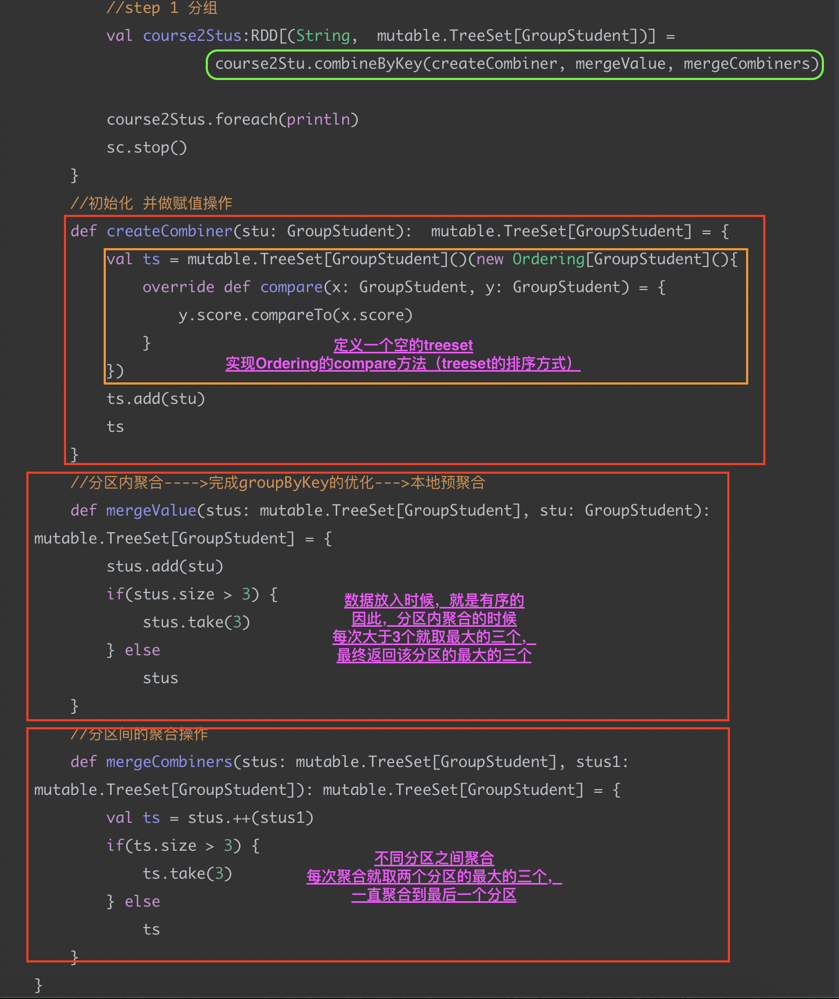

# spark排序

## 普通排序

### sortbyKey函数

源码：

```scala
  def sortByKey(ascending: Boolean = true, numPartitions: Int = self.partitions.length)
      : RDD[(K, V)] = self.withScope
  {
    val part = new RangePartitioner(numPartitions, self, ascending)
    new ShuffledRDD[K, V, V](self, part)
      .setKeyOrdering(if (ascending) ordering else ordering.reverse)
  }
```


按照key进行排序，有两个参数。

| 参数               | 含义                                                         |
| ------------------ | ------------------------------------------------------------ |
| accending：Boolean | true（升序）/false（降序）                                   |
| numPartition：Int  | 排序分区个数，如果需要全局排序，则设置为1，否则就是分区内有序。 |

注意：**如果key是一个二元组**，那么将会先对二元组第一个排序，然后对二元组第二个进行排序。

```scala
//定义了一个（String，Int，Double）的三元组数组
val array = Array (
      ("a", 4, 10.0),
      ("b", 1, 11.0),
      ("c", 9, 5.0),
      ("d", 7, 8.0)
    )
    val temp1RDD = sc.parallelize(array)
//将三元组转化为key-value形式【key是（Int，Double）二元组，value是String】
    val temp2RDD = temp1RDD.map(t=>((t._2,t._3),t._1))
//调用sortbyKey算子，传入参数（true--升序排序，1--一个分区）
    val temp3RDD = temp2RDD.sortByKey(true,1)
    temp3RDD.foreach(println)
    println("*****")
//同上（传入参数：false--降序排序，1--一个分区）
    val temp4RDD = temp2RDD.sortByKey(false,1)
    temp4RDD.foreach(println)
```

结果：

```
((1,11.0),b)
((4,10.0),a)
((7,8.0),d)
((9,5.0),c)
*****
((9,5.0),c)
((7,8.0),d)
((4,10.0),a)
((1,11.0),b)
```

### sortby函数

函数的实现：

```scala
/**
 * Return this RDD sorted by the given key function.
 */
def sortBy[K](
    f: (T) => K,
    ascending: Boolean = true,
    numPartitions: Int = this.partitions.size)
    (implicit ord: Ordering[K], ctag: ClassTag[K]): RDD[T] =
  this.keyBy[K](f)
      .sortByKey(ascending, numPartitions)
      .values
```

该函数最多可以传三个参数：
　　**第一个参数**是一个函数，该函数的也有一个带T泛型的参数，返回类型和RDD中元素的类型是一致的；
　　**第二个参数**是ascending，从字面的意思大家应该可以猜到，是的，这参数决定排序后RDD中的元素是升序还是降序，默认是true，也就是升序；
　　**第三个参数**是numPartitions，该参数决定排序后的RDD的分区个数，默认排序后的分区个数和排序之前的个数相等，即为`this.partitions.size`。
　　从sortBy函数的实现可以看出，第一个参数是必须传入的，而后面的两个参数可以不传入。

----------------------------------------------------------------------------------------------------------------------------------------------------------

​		keyBy函数也是RDD类中进行实现的，它的主要作用就是将将传进来的每个元素作用于f(x)中，并返回tuples类型的元素，也就变成了Key-Value类型的RDD。

```scala
/**
* Creates tuples of the elements in this RDD by applying `f`.
*/
def keyBy[K](f: T => K): RDD[(K, T)] = {
    map(x => (f(x), x))
}
```

案例一：

```scala
    val list = List(3,1,8,19,11,56,35)
    val listRDD = sc.parallelize(list)
    println("按照Int类型排序：")
    val result = listRDD.sortBy(x=>x,true,1).foreach(println)
    println("按照String类型排序：")
    val result1 = listRDD.sortBy(x=>x.toString,true,1).foreach(println)
```

结果：

```
按照Int类型排序：
1
3
8
11
19
35
56
按照String类型排序：
1
11
19
3
35
56
8
```


## 特殊排序

### 二次排序

案例：首先对根据age大小排序，然后在根据name长短排序。

```scala
package com.yber.spark

import org.apache.log4j.{Level, Logger}
import org.apache.spark.rdd.RDD
import org.apache.spark.{SparkConf, SparkContext}
import scala.reflect.ClassTag

object Demo03_2sort {
  def main(args: Array[String]): Unit = {
    Logger.getLogger("org.apache.spark").setLevel(Level.WARN)
    Logger.getLogger("org.apache.hadoop").setLevel(Level.WARN)
    Logger.getLogger("org.spark_project").setLevel(Level.WARN)
    val conf = new SparkConf().setAppName("Demo03").setMaster("local[*]")
    val sc = new SparkContext(conf)

    val list = List(
      new Person("zhangsan",19),
      new Person("lisi",22),
      new Person("wangwu",16),
      new Person("zhaoliu",28),
      new Person("xiaoxi",28),
      new Person("lili",28)
    )
    val personRDD:RDD[Person] = sc.parallelize(list)
    
    //使用sortby进行排序，重写了Ordering中的compare方法
    personRDD.sortBy(p=>p,true,1)(
      new Ordering[Person](){
        override def compare(x: Person, y: Person): Int = {
          var ret = y.age.compareTo(x.age)
          if(ret==0){
            ret = x.name.length.compareTo(y.name.length)
          }
          ret
        }
      },ClassTag.Object.asInstanceOf[ClassTag[Person]]
    ).foreach(println)
    
    sc.stop()
  }
}

class Person extends Serializable{
  var name:String=_
  var age:Int=_
  def this(name:String,age:Int){
    this()
    this.name=name
    this.age=age
  }

  override def toString: String = this.name+"\t"+age
}

```

结果：

```
lili	28
xiaoxi	28
zhaoliu	28
lisi	22
zhangsan	19
wangwu	16
```

### 分组TopN

#### 使用groupbyKey进行分组，然后使用sortWith进行分组排序，最后取分组排序前三。

数据文件：

```
chinese ls 99
math ls 83
english ls 69
chinese zs 78
math zs 80
english zs 80
chinese wu 97
math wu 100
english wu 99
chinese zl 77
math zl 59
english zl 80
```

代码：

```scala
package com.yber.spark

import org.apache.log4j.{Level, Logger}
import org.apache.spark.rdd.RDD
import org.apache.spark.{SparkConf, SparkContext}

object Demo4_group_topN {
  def main(args: Array[String]): Unit = {
    Logger.getLogger("org.apache.spark").setLevel(Level.WARN)
    Logger.getLogger("org.apache.hadoop").setLevel(Level.WARN)
    Logger.getLogger("org.spark_project").setLevel(Level.WARN)
    val conf = new SparkConf().setAppName("Demo4_group_topN").setMaster("local[*]")
    val sc = new SparkContext(conf)
    //加载数据
    val lines = sc.textFile("/Users/zhangyanbo/Echo/course")
   	//将数据转化为（String，GroupStrudent[String,Int]）类型的二元组
    val courseRDD:RDD[(String,GroupStudent)] = lines.map(t=>{
      val fields = t.split("\\s+")
      val course = fields(0)
      val name = fields(1)
      val score = fields(2).toInt
      (course,GroupStudent(name,score))
    })
    //首先按照课程分组
    val course2RDD:RDD[(String,Iterable[GroupStudent])] = courseRDD.groupByKey()
    //输出课程分组的结果
    course2RDD.foreach(println)
    println("-----------------------------------------")
    //使用匹配模式对课程内部排序。
    //排序使用sortWith，按照分数排序。
    //最后排序结果去前三（take3）
    course2RDD.map{case(course,stus)=>{
      val temp1 = stus.toList.sortWith((stu1,stu2)=>{
        stu1.score>stu2.score
      })
      val top3 = temp1.take(3)
      (course,top3)
      //输出排序结果
    }}.foreach(println)
		sc.stop()
  }
}

case class GroupStudent(name: String, score: Int)

```

结果：

```
(chinese,CompactBuffer(GroupStudent(ls,99), GroupStudent(zs,78), GroupStudent(wu,97), GroupStudent(zl,77)))
(math,CompactBuffer(GroupStudent(ls,83), GroupStudent(zs,80), GroupStudent(wu,100), GroupStudent(zl,59)))
(english,CompactBuffer(GroupStudent(ls,69), GroupStudent(zs,80), GroupStudent(wu,99), GroupStudent(zl,80)))
-----------------------------------------
(chinese,List(GroupStudent(ls,99), GroupStudent(wu,97), GroupStudent(zs,78)))
(math,List(GroupStudent(wu,100), GroupStudent(ls,83), GroupStudent(zs,80)))
(english,List(GroupStudent(wu,99), GroupStudent(zs,80), GroupStudent(zl,80)))
```

### 分组TopN\_优化\_1

#### 使用combinebyKey代替groupbyKey。

```scala
package com.yber.spark

import org.apache.log4j.{Level, Logger}
import org.apache.spark.rdd.RDD
import org.apache.spark.{SparkConf, SparkContext}

import scala.collection.mutable.ArrayBuffer

object Demo05_group2_topN {
//定义combinebykey的三个参数（函数）
  def createCombiner(stu:GroupStudent1):ArrayBuffer[GroupStudent1] = {
    val ab = ArrayBuffer[GroupStudent1]()
    ab.append(stu)
    ab
  }
  def mergeValue(stus:ArrayBuffer[GroupStudent1],stu:GroupStudent1):ArrayBuffer[GroupStudent1] = {
    stus.append(stu)
    stus
  }
  def mergeCombiners(stus:ArrayBuffer[GroupStudent1],stus1:ArrayBuffer[GroupStudent1]):ArrayBuffer[GroupStudent1]={
    stus++(stus1)
  }
  //主函数
  def main(args: Array[String]): Unit = {
    Logger.getLogger("org.apache.spark").setLevel(Level.WARN)
    Logger.getLogger("org.apache.hadoop").setLevel(Level.WARN)
    Logger.getLogger("org.spark_project").setLevel(Level.WARN)
    val conf = new SparkConf().setAppName("Demo05_group2_topN").setMaster("local[*]")
    val sc = new SparkContext(conf)
    val lines = sc.textFile("/Users/zhangyanbo/Echo/course")
    val courseRDD: RDD[(String, GroupStudent1)] = lines.map(t => {
      val fields = t.split("\\s+")
      val course = fields(0)
      val name = fields(1)
      val score = fields(2).toInt
      (course, GroupStudent1(name, score))
    })
    //使用combinebyKey进行分组
    val course2RDD:RDD[(String,ArrayBuffer[GroupStudent1])] = courseRDD.combineByKey(createCombiner,mergeValue,mergeCombiners)
    //使用sortWith进行排序，并取排序结果的前三
    course2RDD.map{case(course,stus)=>{
      val top3 = stus.toList.sortWith((stu1,stu2)=>{
        stu1.score>stu2.score
      }).take(3)
      (course,top3)
    }}.foreach(println)
    sc.stop()
  }
}

case class GroupStudent1(name: String, score: Int)
```

结果：

```
(math,List(GroupStudent1(wu,100), GroupStudent1(ls,83), GroupStudent1(zs,80)))
(chinese,List(GroupStudent1(ls,99), GroupStudent1(wu,97), GroupStudent1(zs,78)))
(english,List(GroupStudent1(wu,99), GroupStudent1(zs,80), GroupStudent1(zl,80)))
```

### 分组TopN\_优化\_2

#### 使用treeset存储数据，实现本地预聚合

